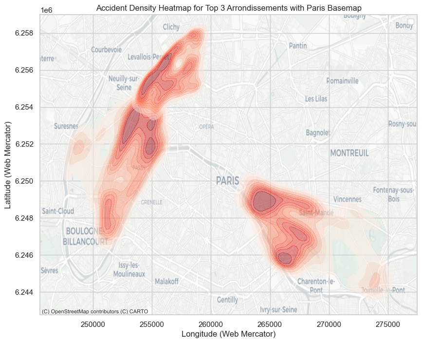
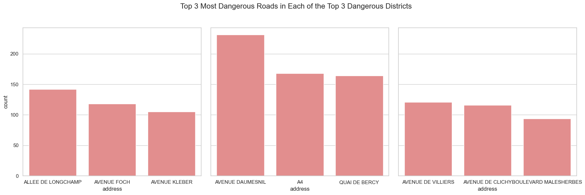
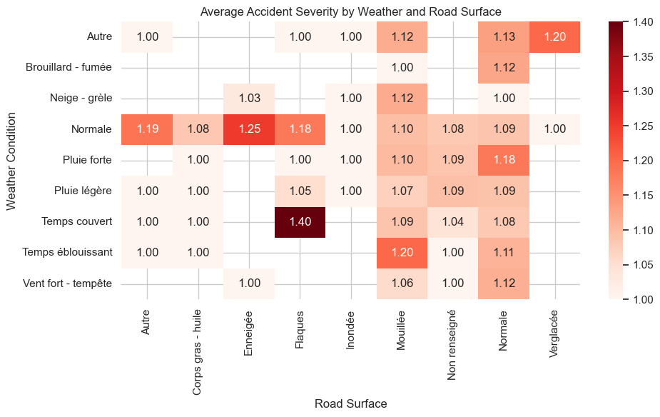
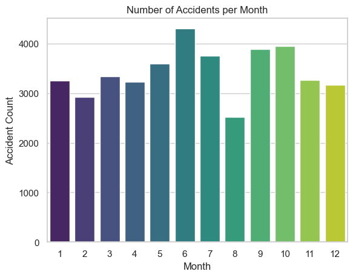

## Executive Summary
Analysis of Paris road accident data reveals several critical patterns that can inform targeted safety interventions across the city. 
The 16th, 12th, and 17th arrondissements consistently record the highest number of accidents, with distinct clusters forming around transition zones where major highways interface with urban streets. These areas, including sections of the Boulevard Périphérique, the A4 highway, and routes connecting to La Défense, create particularly hazardous conditions as drivers transition between high-speed and urban driving behaviors.

Road surface condition emerged as a surprisingly significant factor in accident severity, often surpassing weather visibility in importance. Wet roads consistently correlate with more severe outcomes regardless of overall weather conditions. Most concerning is that seemingly benign scenarios, such as overcast weather with puddles, can be particularly dangerous, likely because drivers underestimate risks when conditions appear only mildly hazardous.

The temporal analysis identified notable seasonal patterns, with accident rates peaking in June, September, and October. These trends likely correspond with increased tourist traffic in summer, back-to-school congestion in September, and challenging early autumn conditions in October when early darkness combines with the first seasonal rains on roads that have accumulated oils during summer.

## Recommendations
The Paris mayor's office should consider implementing a transition zone redesign program at key highway-urban interfaces. This would involve gradually decreasing speed limits beginning 500 meters before major highway exits.

A dedicated road surface management strategy could be developed to address the outsized impact of wet conditions on accident severity. This could include specialized rapid-response teams that prioritize treatment of high-risk areas during light rain events, particularly on the identified dangerous streets in each arrondissement. The city might also test "smart surface" road sections that improve drainage in problematic areas.

Seasonal awareness campaigns would address the identified temporal patterns in accident rates. A September campaign could focus on safe readjustment to normal traffic patterns after the vacation period, while an October initiative might highlight the increased skid risks associated with the first autumn rains. For June, a multilingual safety campaign targeting both tourists and local drivers would help manage the seasonal increase in varied road users, including more motorcycles and scooters during pleasant weather.