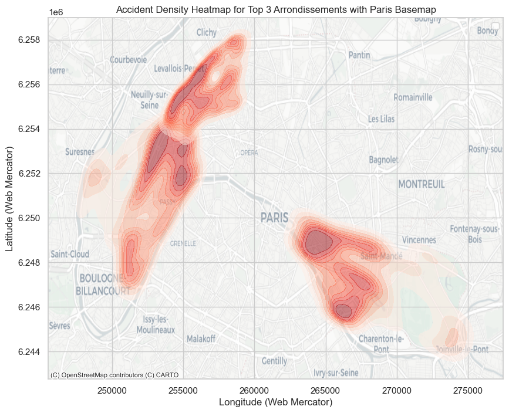
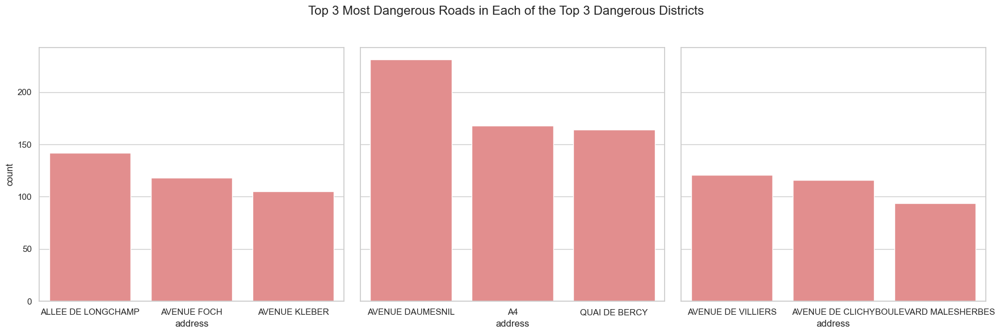
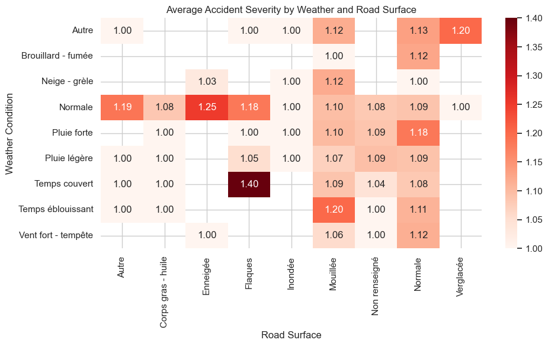
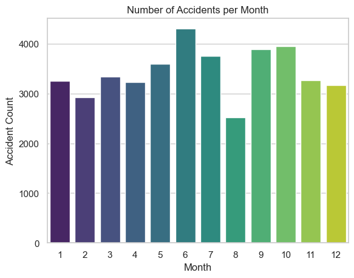

# Paris Road Safety Dashboard

Exploration and dashboarding project built from Paris road accident data.

## Repository Structure

- `analysis/`: data cleaning, parsing and analysis notebooks
- `data/`: raw and intermediate datasets used by the notebooks
- `requirements.txt`: Python dependencies for notebooks and dashboard work

## Main Findings

- The 16th, 12th and 17th arrondissements show the highest accident volumes.
- Transition zones between the Boulevard Périphérique, highways and dense city streets appear repeatedly as high-risk clusters.
- Wet road surfaces correlate strongly with more severe outcomes, even when visibility conditions look moderate.
- Accident peaks appear around June, September and October, suggesting seasonal traffic and weather effects.

## Visuals






## Run Locally

Create a virtual environment, install the dependencies, then open the notebooks or launch the dashboard:

```bash
python3 -m venv .venv
source .venv/bin/activate
pip install -r requirements.txt
```

For notebooks:

```bash
jupyter notebook
```

For a Streamlit app, launch the relevant dashboard entrypoint once it is available in your working branch:

```bash
streamlit run app.py
```

## Data Workflow

1. Load and clean the source accident dataset in `analysis/1 - Loading & cleaning.ipynb`.
2. Parse and enrich location fields in `analysis/2 - Parsing.ipynb`.
3. Explore accident patterns in `analysis/3 - Analysis.ipynb`.

## Notes

- The repository currently keeps intermediate CSV files in version control for reproducibility.
- `calendar` was removed from dependencies because it is part of the Python standard library.
